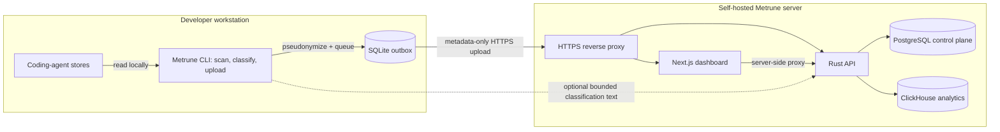

# Architecture

Metrune has one deliberately small privacy boundary: the client reads local
agent stores and the normal upload sends only pseudonymized usage metadata to
the self-hosted server. An explicitly enabled managed-classification request
is the bounded exception. The diagram is the short version; the sections below
document the security, storage, and deployment contracts in detail.

## At a glance

The dashed path is opt-in managed classification and is bounded and
installation-authenticated; it is not part of the normal upload envelope.

## Client pipeline

Each source adapter reads a known local coding-agent store and converts records
into shared usage values. Raw prompts, responses, code, paths, and
provider-owned objects do not cross that boundary. Classification text is
local-only in the Rust type system and cannot be serialized.

Messages become revisioned session snapshots. Raw user, project, and session
identifiers are HMAC-pseudonymized before entering the SQLite outbox. The
outbox retains failed uploads, marks accepted or permanently rejected rows
after an ingest response, and prunes acknowledged/quarantined rows after the
local retention window.

## Classification

An organization explicitly chooses local or managed execution. Local mode
calls the configured model from the client. Managed mode sends at most 64 KiB
of classification text to the authenticated API, which resolves an encrypted
provider credential and returns only a category result. Neither path puts
classification text in the normal upload schema or analytics databases.

Classification failure never blocks usage accounting. A snapshot records
whether classification succeeded, was not configured, was unavailable,
failed, or had no input.

## Server

PostgreSQL owns transactional control-plane data: accounts, memberships,
sessions, invitations, reset tokens, teams, installations, settings, pricing,
and encrypted provider credentials. ClickHouse owns revisioned usage snapshots
and analytical queries. The browser communicates through the Next.js
server-side proxy and never connects directly to either database.

The web proxy forwards only the signed-in session to the API, and middleware
redirects page requests to `/login` before rendering when that session is
absent. Unauthenticated `/api/*` requests receive `401` JSON. Requests fail
closed when the API cannot answer: they render an unavailable state rather than
substituting fixture organization data. UI role visibility is least-privilege
only; the API repeats every authorization check.

Organization-wide session exports remain admin/analyst-only. Every other role
exports only the sessions it owns; the files are named
`metrune-sessions.csv` and `metrune-my-sessions.csv`, respectively. Both paths
preserve the dashboard filters, use `Cache-Control: no-store`, and neutralize
spreadsheet formula prefixes before CSV quoting. Redirect continuations are
restricted to same-origin relative paths by a shared validator.

The API authenticates a web session, service token, or installation token.
Web sessions come from either deployment-wide OIDC or local passwords, never
both at once. OIDC uses discovery, authorization code plus PKCE, and verified
issuer/audience/expiry/nonce/email claims; Metrune still owns authorization and
organization roles.

Native clients use a short-lived OAuth device authorization: a browser session
approves the named machine and the one-time exchange mints its installation
token. The IdP token and browser session never reach the native client. Its
installation token is stored in the OS keyring or a private fallback file.
Legacy one-time enrollment credentials remain available for controlled
automation. Organization scope is derived from the authenticated or approved
principal rather than accepted from the request.

## Deployment

The supported beta topology is one Linux host with four Compose services:
PostgreSQL, ClickHouse, API, and web. An external same-host reverse proxy owns
HTTPS. The repository does not bundle a telemetry collector or monitoring
suite; operators use container logs and the `/v1/healthz` and `/v1/readyz`
endpoints until an observability contract is defined.

## Source layout

- `crates/metrune-core`: upload schema, adapters, classification, and pricing.
- `crates/metrune-cli`: small entrypoint plus CLI application and credential
  storage modules.
- `crates/metrune-api`: small entrypoint plus application routing, identity,
  mail, limits, and error modules.
- `web`: dashboard pages, components, and server-side API proxy.

## Compatibility

- Server and client versions share a compatibility line by major version:
  matching majors are supported together, while a different major is rejected
  with structured HTTP 426. Minor releases add compatible features; patch
  releases contain fixes and security updates. See [VERSIONING.md](VERSIONING.md)
  for the release and rollout contract.
- `schemaVersion` versions the upload envelope and snapshots.
- Session revisions increase monotonically; ClickHouse replacement semantics
  keep the latest accepted revision.
- Additive unknown fields are compatible; breaking payload changes require a
  new schema version.
- Forward-only database migrations are tied to a tagged release and documented
  in its rollback notes.
